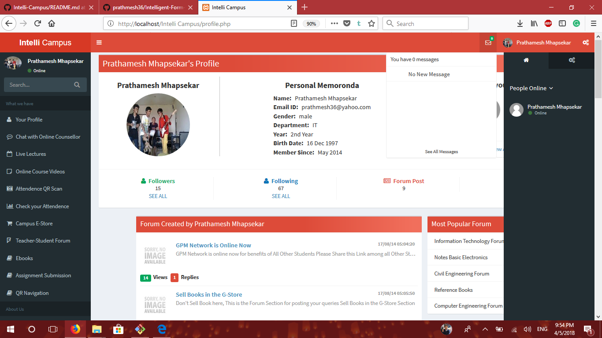
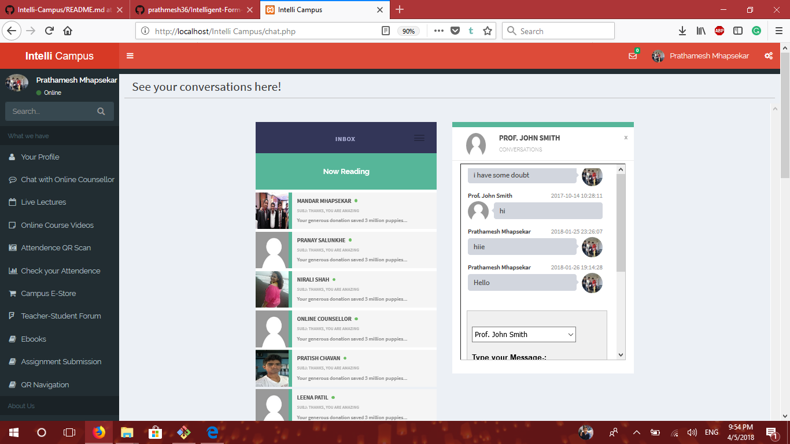
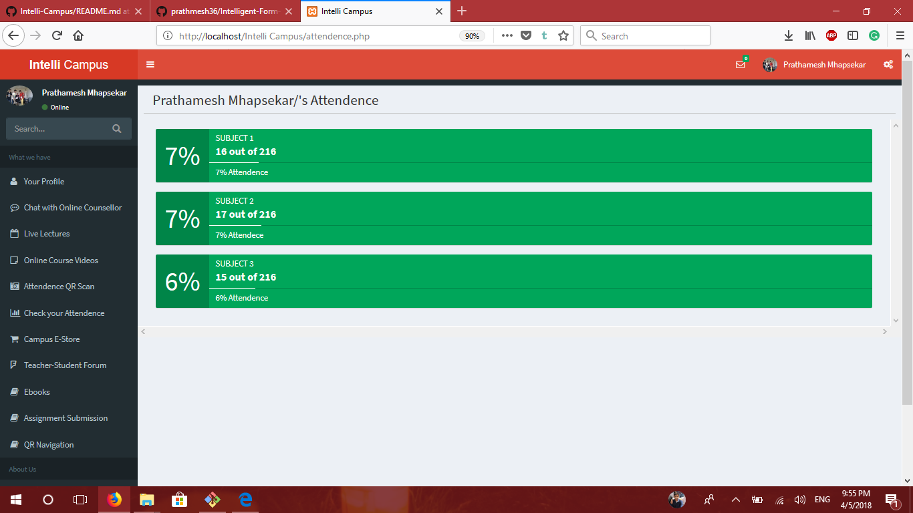
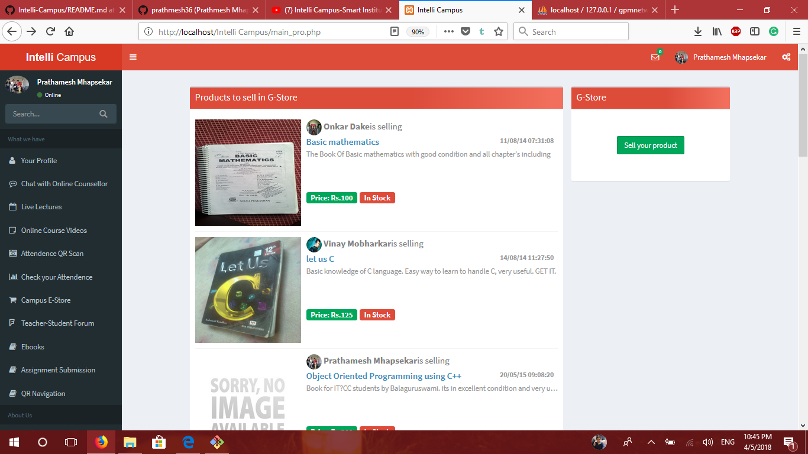
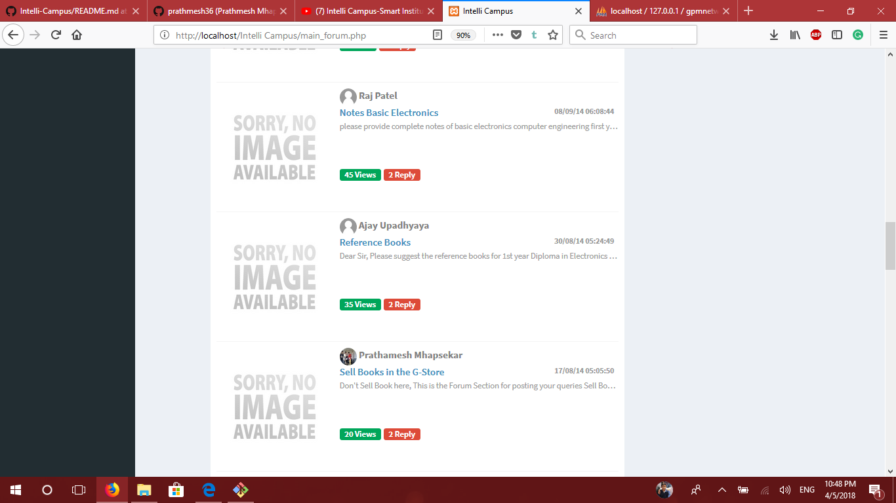
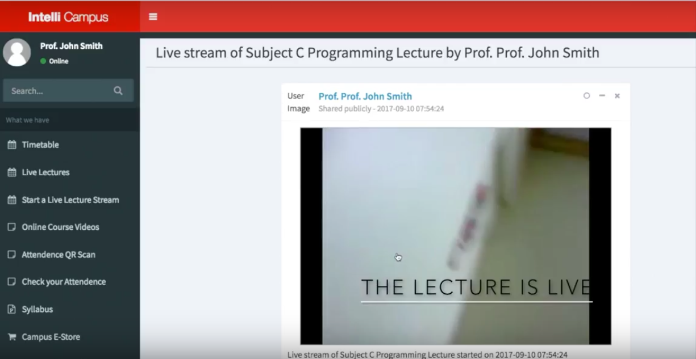

# IntelliCampus
Since education is a powerful instrument of social change and human progress, it is also a powerful tool to cultivate values in an individual. Therefore all the educational institutes have greater responsibility to impart learning and cultivating values through education. To have this impactful change we need to have smart Educational Institutes. Our Nation is currently going through a “Digital Revolution” and this revolution must be brought in the institutions.   
           Today many of our Educational Institutes face the problems such as inadequate resources to get the quality education, less eco-friendly, improper library facilities, lack of distance education for the remote areas, lack of education for students with special needs and poor counseling for students to handle academic pressure.
    To overcome all this hindrance that becomes the hurdle in the way of our institutions to adapt to this era of digitization, we have implemented some economical and feasible solutions that will help to provide equal education and more opportunities to upcoming youth.
Following are the features we have implemented:
* Live streaming lecture service for distance learning.
* Complete video courses on variety of subjects.
* Text-to-speech conversion for blind peoples.
* Cycle services for a bigger campus with a tracking system.
* Online assignment and test system for the ease of students and also for environment conversation.
* Efficient Attendance System with QR for teachers
* Campus and live activity navigation system using QR
* Online Counselling for students to overcome depression due to academic stress.
* Portal to bring students and teachers with similar field of interest on a single platform using online project section.
* Academic Centralization web portal for connecting student to help each other and student-teacher portal for 24x7 doubt solving and research work
* Online Stationery system portal to avoid irregularity in prices of stationery at institute level

## Getting Started

* After cloning the project you need to import the project's database from DB Folder into phpmyadmin of your local machine.
* Now you are ready to run the project on your local machine.

### Setting up Live Stream.

* Create your account on EZ Web Player and Download Adobe Flash Media Live Encoder.
* Once you create a account on EZ Web Player you will get a RTMP Live Stream URL.
* Use that link in Adobe Flash Media Live Encoder as FMS URL and then connect and start recording the live stream video.
* Go to EZ Web Player Dash Board and Add a Video using RTMP Live Stream Option.
* Now your Live Stream is generated.

Link: [https://www.youtube.com/watch?v=gqiR5ibbYfI](https://www.youtube.com/watch?v=gqiR5ibbYfI)

### Prerequisites

* [Xampp PHP 5.6 or Above](https://www.apachefriends.org/download.html)
* [Adobe Flash Media Live Encoder](https://www.adobe.com/go/fmle)
* [EZ Web Player](http://www.ezwebplayer.com/)

## Demo

### Login Page

### Profile Page

### Chat System for Online Counseling

### Attendance Tracking

### College E-Commerce

### Student-Teacher Forum 

### E-books

### Live Streaming Lectures

### QR based Attendance

## Built With

* [EZ Web Player](http://www.ezwebplayer.com/)
* Admin LTE 2 Bootstrap Template

## Authors

* **Mandar Mhapsekar**-[mandar10](https://github.com/mandar10)
* **Prathmesh Mhapsekar**-[prathmesh36](https://github.com/prathmesh36)
* **Raj Patel**
* **Aniket Mhatre**

## License

This project is licensed under the MIT License - see the [LICENSE.md](LICENSE.md) file for details
